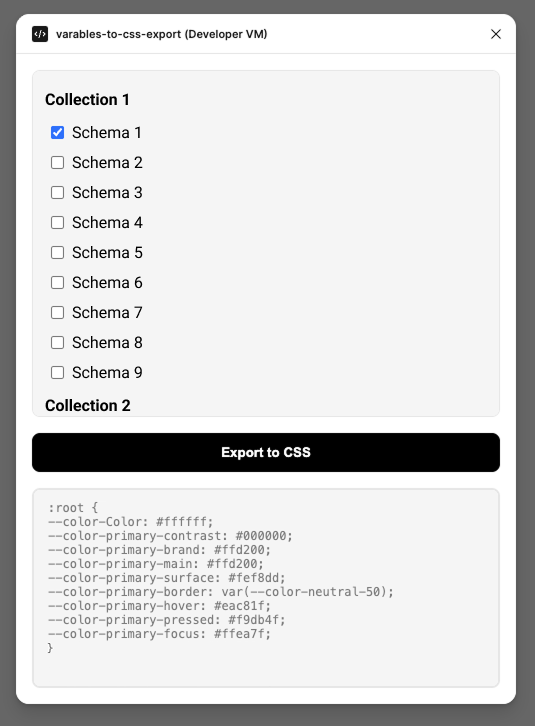

# Variables to CSS Export

A plugin for design token variables conversion into CSS custom properties with custom-made formatting and handling rules

## Variable parsing rules

- **Numerical variables:** All numerical variables are assigned the "px" suffix
- **Exemptions from "px" suffix:** Variables containing the terms "bold", "regular", "weight", or "visibility" will not have the "px" suffix applied
- **Case sensitivity:** Variable names are case-sensitive and will remain unchanged, adhering to variable naming convention
- **Exclusion criteria:** Any variable containing "ux" in its name will be excluded from the export process
- **Font family name handling:** Variables that define font family names are exported with whitespace preserved, while all other string variables are exported without quotation marks

## How to use

There are multiple ways of using the plugin:

### Figma Community Link

1. Visit the [Variables-to-CSS Export plugin page](https://www.figma.com/community/plugin/1513129221792384299/variables-to-css-export) on Figma Community
2. Click the **"Open in..."** button
3. You'll be prompted to open it in a Figma file - select a project of your choice
4. The plugin should be added to your file

### Using manifest import

1. Clone this repository
2. In Figma, open any Figma file where you want to use the plugin
3. Click the Figma logo in the upper left corner and navigate to **Plugins** → **Development** → **Import plugin from manifest**
4. Provide the manifest file (`manifest.json`) from this repository
5. The plugin will be imported and available in your workspace

### Running the Plugin

Once installed via either method:

1. Open your Figma project containing design variables
2. Navigate to **Plugins** menu → **Variables to CSS Export** → **variables export**
3. The plugin panel will open in your right sidebar
4. Select which variable modes you want to export by checking the appropriate checkboxes
5. Click the **"Export to CSS"** button
6. Your CSS custom properties will appear in the textarea below
7. Copy the output and paste it into your CSS file or project

